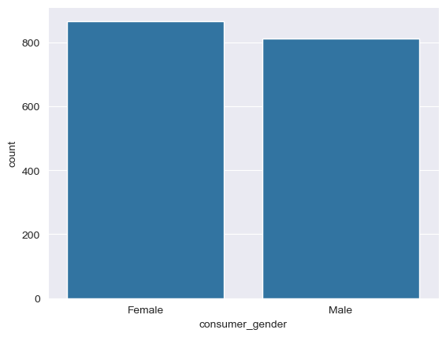

# Fraud Exercise for Candidates

This repo contains a fraud analysis exercise: predict whether a payment made to a merchant is fraudulent or not.

## Business Case
Fraud operation team members at the popular BNPL company __XYZ__ noticed some suspicious payments one afternoon in the system. After some basic investigations, the member flagged some payments as potential fraud and escalated the situation to the team's data scientists.

As __XYZ__ does not pend any payments, the fraud team would need to observe the payment patterns in the past days and adjust the current model to reject future fraudulent payment attempts.

The dataset contains transaction data from 4/26 - 5/8.

The data scientist must prepare an analysis and presentation for their managers on 4/28 based on the data they received. The presentation should answer the general questions below:

## Questions
1. __What could you tell us about the data (for data prior to 4/28)__
    - User age is a wide range, from 16 to 70 years old, with the average user being 43.

    - Very large majority of users use iPhone OS (1566, 71%) to use the app
    - Over 1000 payment transactions each day (1075 and 1116)
    - Most purchases were made at 9pm (209) and 10pm (236)

    - Fewest purchases were made at 5am (18)
    - Most payments were under 10000 (most common was 2000), largest payment was 165000
    - Pretty even split of female:male users, 52:48 respectively

    - Payments that were flagged as potential fraud by operator (69 rows total)
        - All first time purchases at the respective merchant
        - All purchases from Blue Shop
        - All used a Windows NT device
        - All had the payment timestamp created before the account created timestamp
        - None of the email addresses used at signup were from a Gmail account
        - 49/69 do not have matching buyer and consumer phone numbers
        - 18/69 do not have matching buyer and consumer email addresses

2. __What features are predictive of fraud?__    
    - Device used to create the payment
        - particularly if they use a Windows NT device or not

    - Time difference between the payment timestamp and account creation timestamp
        - particularly if the payment was created before the account was created
    - Payment amount

3. __Propose the next step(s) based on your analysis__
    - speak to the team operator to discuss what caused them to flag the payments as potentially fraudulent
    - investigate how the timestamps are being created for payment and account creation
        - How are users able to create a payment in the app before having an account?
        - Is this a timestamping issue or a bug?
    - Speak to design team and confirm app function
        - Can a user without an account make a payment to a merchant?
    - After confirming with fraud team, update the current model to flag/reject payments based off these features

4. __How would you monitor the proposed solution?__
    - Create a dashboard to track purchases from other merchants that:
        - use a Windows NT device
        - make a payment before having an account
    - Filter the dashboard by merchant to see if other merchants are having similar issues with similar users

5. __What additional data points do you think could help with your decision?__
    - items purchased
        - name
        - category
        - price
    - account purchase history

6. __What are the ML techniques you used and the reason you chose them?__
    - EDA
        - to understand dataset (features, patterns, generalizations)
    - imputation
        - fill fraud_flag rows that weren't filled by operator
        - fill missing device/verison rows with mode (categorical feature)
    - feature engineering
        - converting time object columns into timestamps
        - creating hour/day/weekday features from timestamp features
        - creating time_diff feature that calculates the time between payment timestamp and account creation timestamp
        - create binary column to track if:
            - buyer and consumer email for the purchase are the same
            - buyer and consumer phone for the purchase are the same
    - feature encoding
        - change categorical columns [device, merchant_name] to one hot encoded columns
    - train-test-split
        - 70:30 train:test split for model training and evaluating
    - determining feature importance using random forest classifier
        - to cut down and remove features that are irrelevant to the target variable to increase performance of model training
    - transforming features
        - quantile transformer for the features [amount, time_diff] due to heavy right skew and outliers to normalize distribution
    - cross validation
        - to improve model performance and decrease the chances of over-fitting on training data
